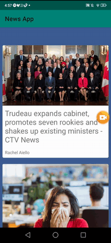

# NewsApp
Android app written in Kotlin, powered by NewsAPI.org

Implemented the following:
- Live data from NewsAPI.org
- Shared element transition (Image from list to image in details page. Pretty cool!)
- Material Design Card component
- Material Design Floating Action Button
- SwipeRefreshLayout (pull to refresh)

Todo:
- Share button
- Filter data from API. Currently set to top headlines in Canada
- Prettier design!
